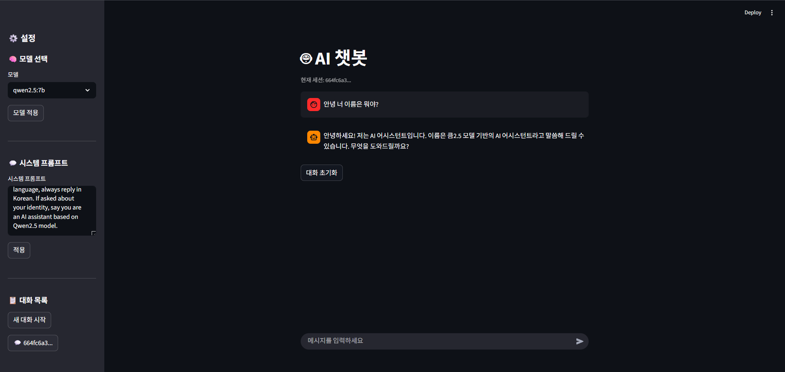

# 🤖 Local LLM Chatbot

> Ollama + FastAPI + Streamlit 기반 로컬 LLM 챗봇

---

## 📌 프로젝트 소개

외부 API 없이 로컬 환경에서 완전히 동작하는 LLM 챗봇입니다.
Ollama를 통해 다양한 오픈소스 모델을 실행하고, FastAPI 백엔드와 Streamlit 프론트엔드로 구성된 풀스택 AI 챗봇입니다.

---

## ✨ 주요 기능

- 🧠 **모델 선택** — Ollama에 설치된 모델을 사이드바에서 자유롭게 전환
- 💬 **시스템 프롬프트 설정** — 챗봇의 페르소나를 직접 커스터마이징
- ⚡ **스트리밍 응답** — 실시간 타이핑 효과로 자연스러운 UX
- 🗃️ **대화 히스토리 저장** — SQLite DB에 세션별 대화 저장
- 📋 **세션 관리** — 새 대화 시작, 이전 대화 불러오기, 세션 삭제

---

## 🛠️ 기술 스택

| 역할 | 기술 |
|---|---|
| LLM 서빙 | Ollama |
| 기본 모델 | Qwen2.5-7B (4bit) |
| 백엔드 | FastAPI |
| 프론트엔드 | Streamlit |
| 데이터베이스 | SQLite |
| 언어 | Python 3.10 |

---

## 💻 실행 환경

- OS: Windows 10/11
- GPU: NVIDIA RTX 4060 Ti 8GB
- Python: 3.10
- Ollama: 최신 버전

---

## 🚀 설치 및 실행

### 1. Ollama 설치
[https://ollama.com](https://ollama.com) 에서 다운로드 후 설치

### 2. 모델 다운로드
```bash
ollama pull qwen2.5:7b
ollama pull mistral:7b
ollama pull gemma3:4b
ollama pull llama3.2:3b
```

### 3. 저장소 클론
```bash
git clone https://github.com/{your-username}/local-llm-chatbot.git
cd local-llm-chatbot
```

### 4. 패키지 설치
```bash
pip install fastapi uvicorn ollama streamlit
```

### 5. 실행

터미널 1 — FastAPI 백엔드:
```bash
uvicorn main:app --reload
```

터미널 2 — Streamlit 프론트엔드:
```bash
streamlit run app.py
```

### 6. 접속
브라우저에서 `http://localhost:8501` 접속

---

## 📁 프로젝트 구조

```
local-llm-chatbot/
├── main.py          # FastAPI 백엔드
├── app.py           # Streamlit 프론트엔드
├── database.py      # SQLite DB 관리
├── chat_history.db  # 대화 히스토리 저장 (자동 생성)
└── README.md
```

---

## 📸 스크린샷



---

## 📄 라이선스

MIT License